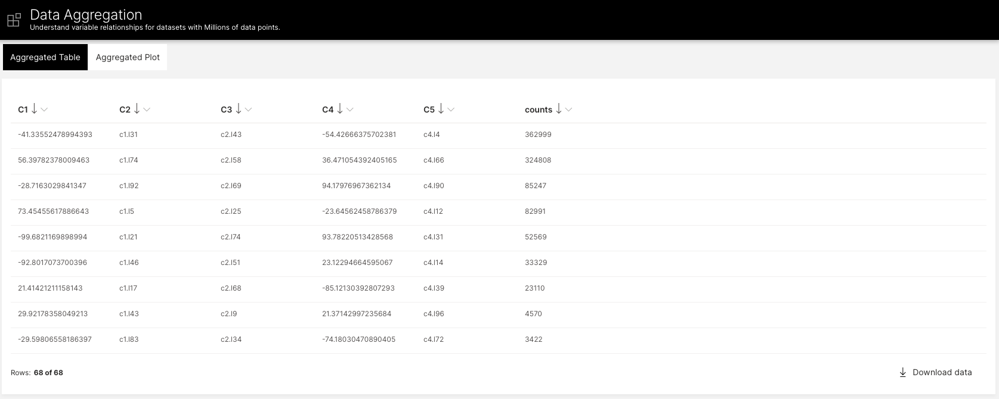
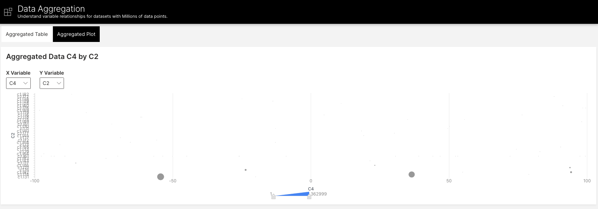

# Wave Big Data Visualizer

This open source Wave application is a starting point for allowing users to aggregate and visualize large amounts of 
data. It was built for the `Making Waves` webinar and can be used in conjunction with that demo video to start 
developing your own H2O Wave apps.





## Local Development

Python 3.7 is recommended as this is the version running by default in the H2O AI Hybrid Cloud. If you do not have 
a `python3.7` alias setup, update the `Makefile` to use your default `python3` environment. If you do not 
have `make` installed, you can individually run the commands which are in the `Makefile`.

Clean any existing environment and H2O Wave server:
```shell script
make clean
```

Build a python environment:
```shell script
make setup
```

Download and run the H2O Wave server:
```shell script
make wave run-wave
```

Run the application in development mode which will auto-update with any code changes:
```shell script
make run-app
```
